<!-- ══════════════════════════════════════════════════════════════ -->
<!--  TXDO // profile readme — terminal edition                      -->
<!--  assets/ folder must ship with this file                        -->
<!-- ══════════════════════════════════════════════════════════════ -->

<p align="center">
  
</p>

<p align="center">
  <a href="https://github.com/TedoNeObichaJavaScript">
    
  </a>
</p>

<p align="center">
  
  
  
</p>

<p align="center"></p>

<p align="center">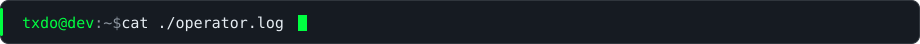</p>

```text
┌──────────────────────────────────────────────────────────────┐
│  HANDLE      TedoNeObichaJavaScript                          │
│  ROLE        Founder · Game Director · Full-stack dev        │
│  AGE         20                                              │
│  BASE        Sofia, Bulgaria [42.6977 N, 23.3219 E]          │
│  MISSION     Kill the snooze button. Permanently.            │
│  DAILY OPS   Kotlin · Jetpack Compose · Firebase · Gradle    │
│  RESEARCH    Kotlin Multiplatform · Compose Multiplatform    │
│  SIDE OPS    Claude-powered dev tools · custom MCP servers   │
│  FLEET       up to 8 Claude Code agents in parallel          │
│              (research / impl / tests / review)              │
└──────────────────────────────────────────────────────────────┘
```

<p align="center">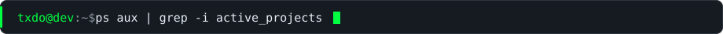</p>

```text
PID    PROJECT       STATUS      DESCRIPTION
0001   snooze-city   BUILDING    game · role: Game Director · classified.
0002   nooze         LIVE        no-snooze alarm · smart wake · gamified
                                 wake-up challenges · smart-home control
0003   kmp-port      R&D         taking Nooze cross-platform
0004   mcp-tools     SIDE-OP     Node.js MCP servers for my own workflow
```

<p align="center"></p>
<p align="center"><sub>Org: <a href="https://github.com/Nooze-Alarm"><b>Nooze</b></a> · Live product: <a href="https://noozealarm.com"><b>noozealarm.com</b></a></sub></p>

<p align="center">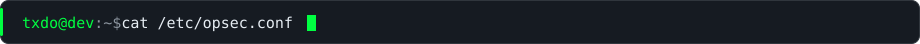</p>

```ini
; how I ship — non-negotiable
trust_the_client   = never          ; the server is the source of truth
secrets_in_repo    = never          ; scanned before every push
data_at_rest       = encrypted      ; always
data_in_transit    = tls_only
passwords          = hashed + salted, never plaintext
access_control     = deny-by-default
user_input         = untrusted until proven otherwise
```

<p align="center"></p>

<p align="center">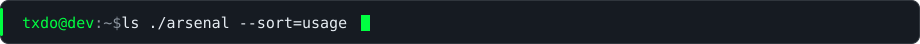</p>

**`> languages/`**

<p>
  
  
  
  
  
  
  
  
  
  
  
  
  
</p>

**`> frameworks/`**

<p>
  
  
  
  
  
  
  
  
  
  
  
  
</p>

**`> databases/`**

<p>
  
  
  
  
  
</p>

**`> toolchain/`**

<p>
  
  
  
  
  
  
  
  
  
  
  
  
</p>

<p align="center"></p>

<p align="center">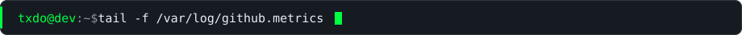</p>

<p align="center">
  
  
</p>

<p align="center">
  
</p>

<p align="center">
  
</p>

<p align="center">
  
</p>

<!-- contribution snake — requires the snake.yml workflow in this repo -->
<p align="center">
  
</p>

<p align="center"></p>

<p align="center">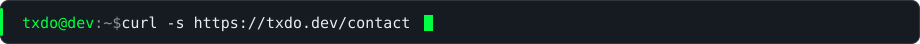</p>

<p align="center">
  <a href="https://www.linkedin.com/in/teodor-mirchev-91115a305">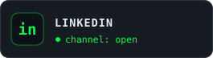</a>
  <a href="https://instagram.com/t.db3">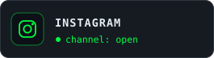</a>
  <a href="https://noozealarm.com">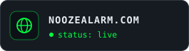</a>
</p>

```text
txdo@dev:~$ shutdown -h now
[ OK ] Session terminated. The alarm, however, cannot be snoozed.
```

<p align="center"></p>
<p align="center"><sub><code>// EOF — no snooze detected</code></sub></p>
